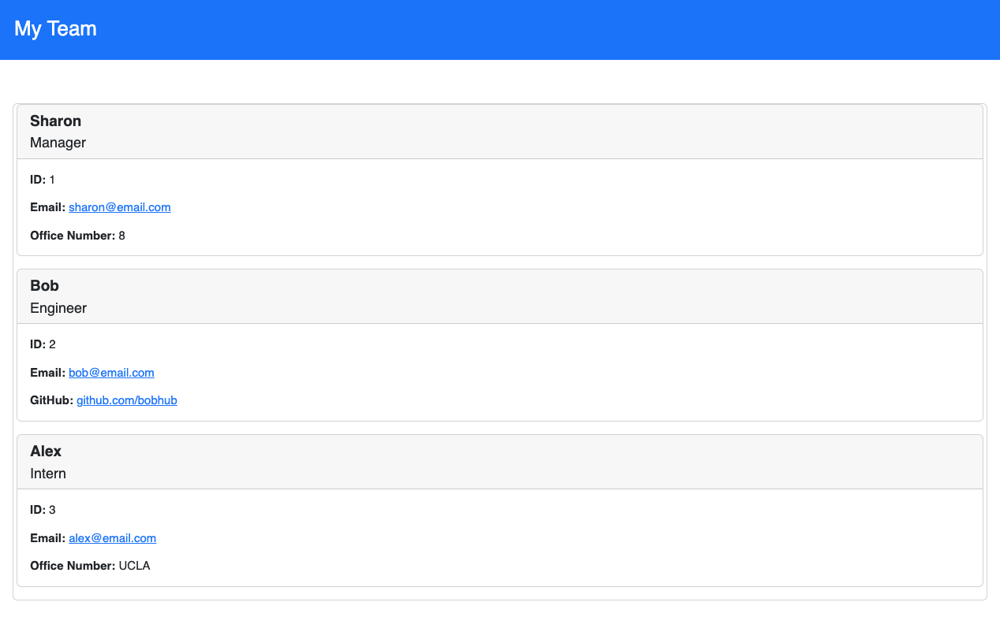

# Software Engineering Team

## Description

* The repository shows a Node.js command-line application that takes in information about employees on a software engineering team,then generates an HTML webpage that displays summaries for each person.  It has a responsive user interface to be laid out properly on various size screens.

## Functionality

* From the command line, the user is prompted for information that will generate cards for their team members, including an employee, manager, engineer and intern.  The user is asked questions relating to the team members, including their names, roles and email addresses.  In addition to these questionos which are asked, questions will be asked to retrieve the following: the office number ID for the manager; the github address of the engineer; and the schoool attended by the intern. 

* The application will be invoked by using the following command in the terminal: node index.js

## Code

* The command-line application will dynamically generate the file from a user's input using the [Inquirer package](https://www.npmjs.com/package/inquirer/v/8.2.4) for Node.js.  

* The application uses [Jest](https://www.npmjs.com/package/jest) for running the unit tests and [Inquirer](https://www.npmjs.com/package/inquirer/v/8.2.4) for collecting input from the user. 

* The application includes Employee, Manager, Engineer, and Intern classes. The application runs tests for these classes (in the `_tests_` directory).

* The project uses Bootstrap and Fontawesome, with links shown on the head section of the HTML.  There is also linked CSS stylesheet in the head section of the HTML. 

* The HTML code contains a logical structure for the elements within the page.  There are sections within the body showing how the first page looks.

* Comments have been applied to the different files in the code to identify each section of code. 

## Code

* There is an index.js file that lays out the code from which the README file is generated.  

* Included is a package.json file with the required dependencies, as well as gitignore, node_modules and .DS_Store files.

## Installation

* The code for this project can be found on GitHub at: https://github.com/c-alanwill/software-engineering-team

* A link to a video that shows a walkthrough demonstrating how this readme works is available at: https://drive.google.com/file/d/18AR4thXgKrAxyQcoxuTFmlIJY9Yr9OwO/view?usp=sharing

## Usage

The following image demonstrates the web application's appearance and functionality:

## Credits

N/A

## License

Please refer to the license in the repo.

## Contributing

N/A